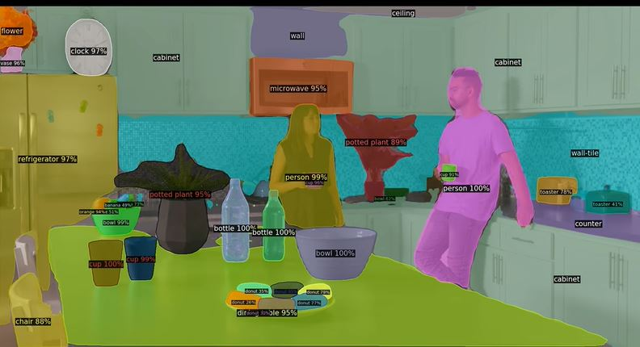
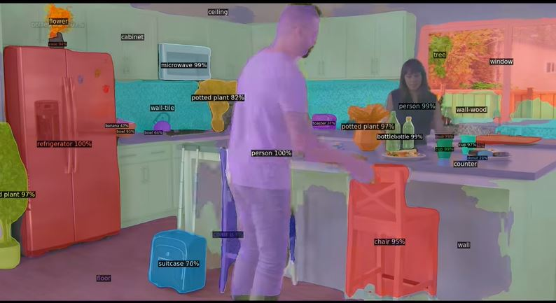

Segmentation Test
===

The aim of this exercise is to assess your level of proficiency with computer vision and deep learning in general, and with image segmentation tasks in particular. We are not asking you to implement a segmentation model from scratch, but to document the steps you would take to successfully deliver the proposed exercise.

Goal
---

The goal is to design and implement a Deep Learning prototype able to recognize surfaces present in architectural ambient images. You may use any framework or library you see fit. We recommend researching state-of-the-art libraries like [Detectron2](https://ai.facebook.com/blog/-detectron2-a-pytorch-based-modular-object-detection-library-/). As per training data, we have previously used [Open Surfaces](http://opensurfaces.cs.cornell.edu), but some categories from [COCO](https://cocodataset.org/#home) or [OpenImagesV6](https://storage.googleapis.com/openimages/web/index.html) could give you a good starting point.

The benchmark is a reduced version of Detectron's mask detection output:




You should provide a roadmap of your implementation, providing a detailed description of your line of thought, touching on:
*   Data issues
    *   Where did you get training data from?
    *   Was it enough or sufficiently tailored to the problem?
    *   How would you get more training data, and what would that mean in terms of time?
*   Implementation
    *   Any general notes on your design decisions
    *   Challenges you encountered and how did you overcome them
*   Training
    *   Consider using transfer learning to have a running prototype
    *   How would you refine the pretrained network on the categories of interest
    *   Any error metrics used to validate and fine-tune the model

If you feel brave, you can give the implementation a go. In that case, you should create a runnable python program that can be called from the command line like this:
```bash
$ python segment.py --url "https://randomsite.com/myimg.jpg"
```

The program should download the image from the provided URL and infer the different segments present on it. Inference should be done on CPU - preferrably after loading your trained models. 

The model should be able to detect one of the following categories: Wall, floor, dining table.

Then it should store a JPG file in the `./output` folder with the following naming convention:
```python
f'{surname}_{name}__{time.now()}.jpg'
```
That file should display the original image, with semitransparent masks applied on top of each of the detected segments, as shown in the reference images above.

***

You would need to add any pseudocode / jupyter notebooks / actual code you might have used to design and train your models.
Well documented code is a plus. If you used an environment manager like conda or poetry, please add details on how to activate it so your inference program works nicely. 

Looking forward to seeing your approach!


