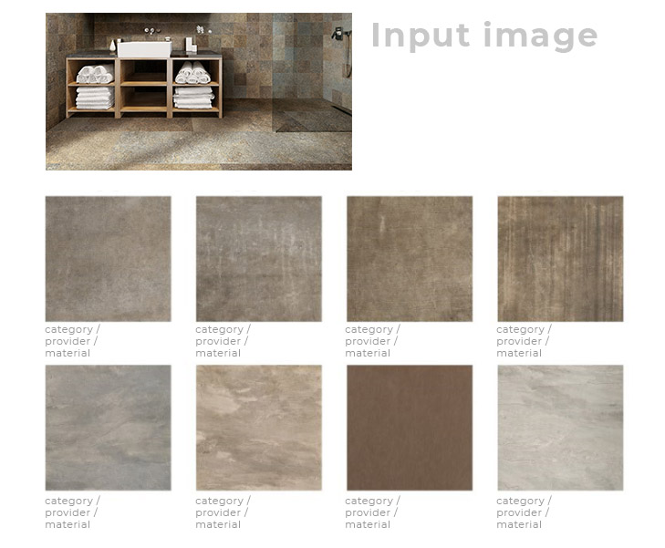

Distance Test
===

The [starting dataset](https://drive.google.com/file/d/1IIK5xr4VpbhZPkZLVAV5m1SCRRtaLWul/view?usp=sharing) is a collection of images coming out of a generalist search engine. We have collated some metadata in the [accompanying csv](./assets/2011_material_info.csv), which has the following columns:

| Column | Description |
| ------ | ----------- |
| `category` | The category we searched for in the search engine |
| `dimension_a` | A random dimension |
| `dimension_b` | A random dimension |
| `finishing` | A random finishing |
| `img_info_percentage` | Percentage of the image that contains information |
| `main_color` | Main RGB triplet  |
| `main_color_frequency` | Percentage of the image containing the main color |
| `material` | A randomized material |
| `palette` | Set of predominant 5 colors in the image |
| `price` | A random price |
| `provider` | A random provider |
| `uuid` | Unique identifier |
| `weight` | A random weight |


Each one of the images pertains to one of the following categories: 

```
category             count
--------------------------
sofa                  1510
natural stone tile     911
bathroom tiles         896
kitchen tile           885
ceramic tile           867
azulejo portugues      600
wood tile              593
```

Beware that the provided dataset is not real data, but images taken from search engines - inconsistencies are to be expected.  

You would need to design a distance model that takes a random image and returns the closest 5 items in the dataset.

### Output
The output should be a juptyer/colab notebook so we can follow your process. You might as well create a runnable python code that we can call from the command line, like:
```bash
$ python recommend.py --url "https://randomsite.com/myimg.jpg"
```
This output is optional, and the notebook should suffice. If you decide to implement it, the program should download the image and infer a complementing set of materials. Inference should be done on CPU. Then it should store a JPG file in the `./output` folder with the following naming convention:
```python
f'{surname}_{name}__{time.now()}.jpg'
```
where your name and surname should be inserted.  

This image should have:
*   The original input image
*   Up to 8 of the closest products identified by your model
*   Category, provider and material label for each product



Distance algorithms tend to be biased on color. Can you propose a way to alleviate this, so the model can return similar images attending to other structural properties of the image like
*   Geometry (is it a brick, or a set of tiles, or a swatch?)
*   Color homogeneity, variance, contrast, saturation...
*   Texture (veins, dots, lines, grain...)

Extra points if you come up with a model that can take these into account on user input - you might need to enrich the dataset first. 

### Bonus
Extra points will be granted for the following:
*   Naming the two closest categories to the input image
*   Explain how you would find more and cleaner data to work with
*   Explain potential enrichment processes that could improve the distance algorithm
*   Explain challenges you encountered and issues likely to arise when working with this kind of images, and how would you solve them. Special emphasis on issues of scale, lighting, distortion, etc.
*   Knowledge and application of Image augmentation techniques

***

You would need to add any jupyter notebooks / python code you might have used to design and train your models. Well documented code is a plus. If you used an environment manager like conda or poetry, please add details on how to activate it so your inference program works nicely. 

Looking forward to seeing your approach!
